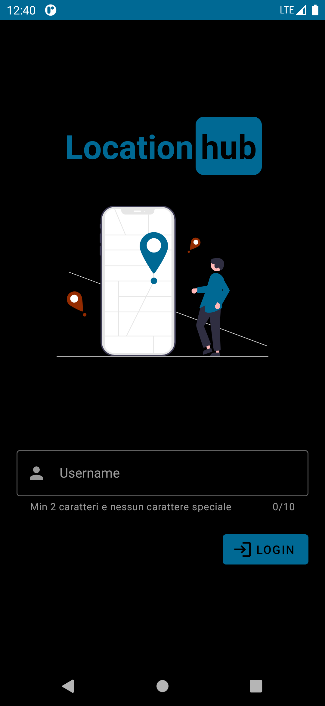
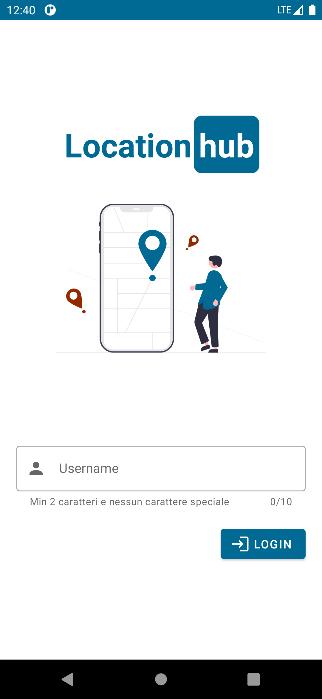
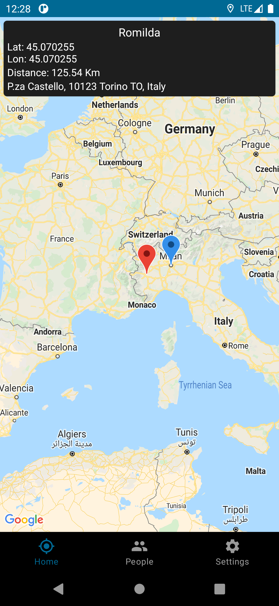
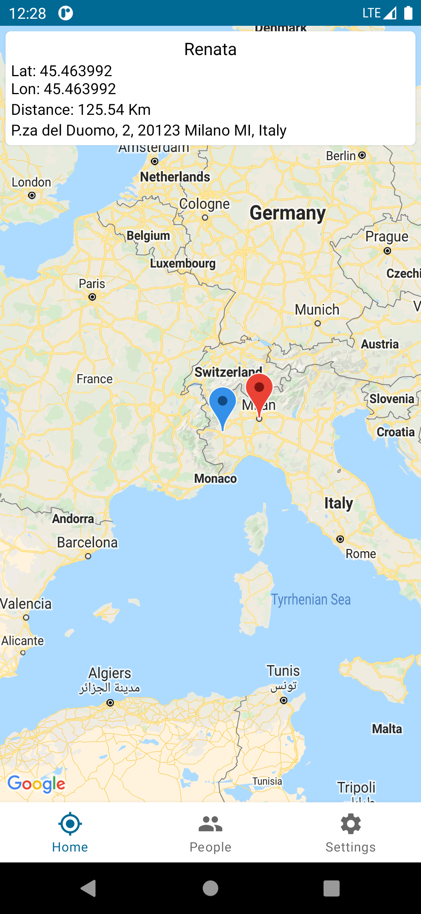
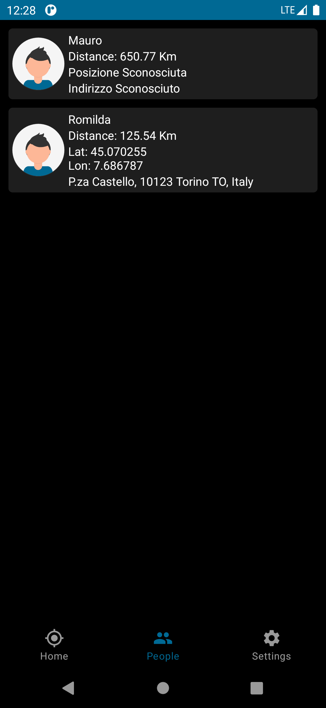
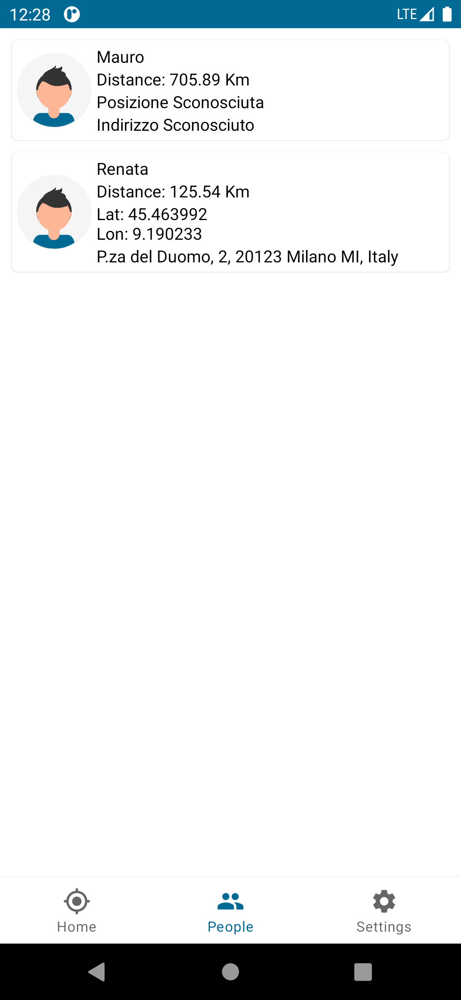
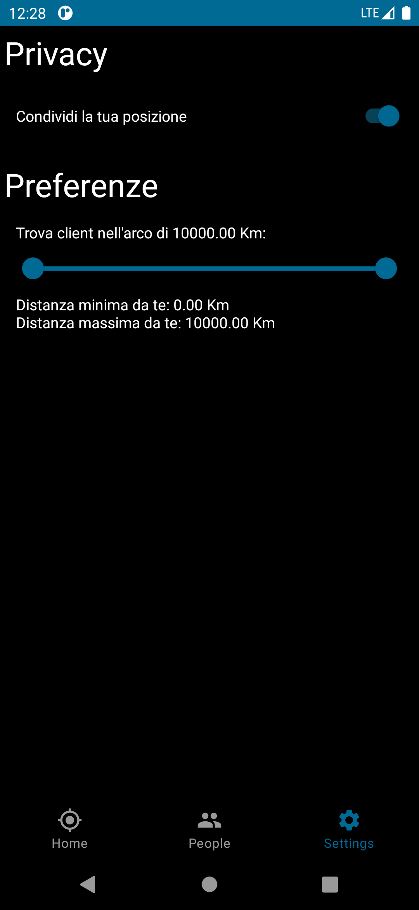
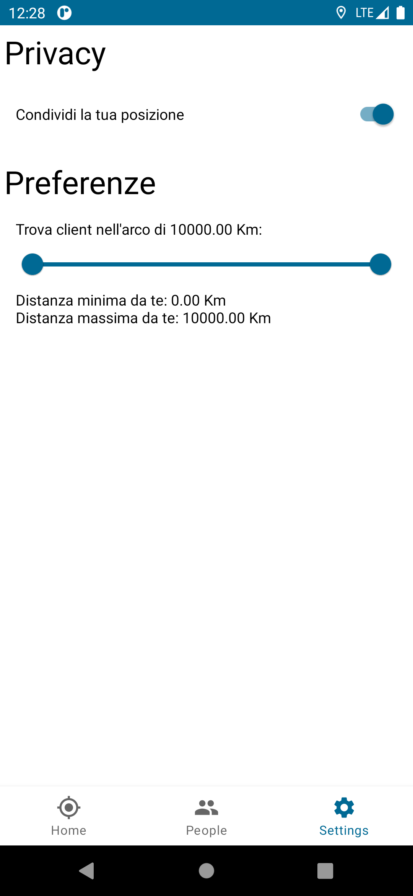

# Location Hub

Tech Stack:  Java (Android Mobile App), C & UNIX library (Server)\
\
University of Naples Federico II \
Operating System Lab Project\
\
My university colleague Davide Pio Faicchia and I, were asked to create a multi-threading client-server system that allows clients to share their geographical location.  The system offers services like allowing users whether to publicly display their location or not and showing all connected clients sorted from closest to farthest.

## How to build

See `Makefile` for the build scripts.

To build simply run `make` at the command line in the `server` directory.

By default, this will generate an executable called `myserver`.
To then run the program:

```
./myserver <PORT>
```

in the `server` directory.

In order to remove all `.o` files generated in the compilation phase, run `make clean`

## Android client

The Android client compilation requires a `local.properties` with the following keys:
```
MAPS_API_KEY= You could get one at https://developers.google.com/maps/documentation/javascript/get-api-key
serverIp= Server IP address
serverPort= Server PORT number
```

| Dark | Light |
|:-------------:|:-------------:|
|||
|||
|||
|||
